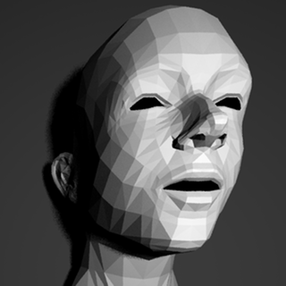

# PyTracer

*Proudly rendered with `pytracer`, head model courtesy of C348b.*

## Introduction

PyTracer is a photo-realistic rendering interface
backended by ray tracing. It may sound
counter-intuitive that one may ever wish to
implement a ray tracer with `Python`, nevertheles,
PyTracer makes it feasible to do fast prototyping
using current state-of-the-art learning libraries
which are mostly implemented in `Python`.

Indeed, albeit to being *a little bit* slow, PyTracer can do it pretty well.
Its object-oriented nature and modular design enables easy experiementing
of new algorithms.
The development and implementation of PyTracer largely take references from
*[Physically Based Rendering](http://pbrt.org/)*,
both second and third edition.

## Installation

Currently, the integration with `C++` has not completed, hence
no compile is needed. PyTracer has the following dependencies:

- scipy: for KDTree structure for fast measured texture retreival
- numpy, PILLOW: for image I/O
- quaternion: for interpolation of motion transformations

To install the dependencies using `pip`, one may issue the following command:

    pip install -r requirements.txt
    pip install numpy-quaternion

After preparation, clone PyTracer via:

    git clone https://github.com/zjiayao/pyTracer
    cd pyTracer

One may also wish to unit test several low-level modules before use
(assume `pytest` is installed, otherwise, one may do a `pip install pytest`):

    PYTHONPATH=$PWD:$PYTHONPATH py.test

It might be convenient to move the `pyTracer` directory to your favourite
location and add it to your `PYTHONPATH` (for example, under a `virtualenv`),
assuming current directory is the root of `pyTracer`, one may add it via:

    export PYTHONPATH=$PWD:$PYTHONPATH py.test

## Quick Start

The main work flow of PyTracer is analogous to `pbrt`. To start,
one may render the sample head model image via:

    python -c "import examples/head_mesh_render.py"

This gives a quick rendering of `128 * 128` pixels, with straitified sampling
of `1 * 1` sampling rate. By default the rendered image is written to `tmp.png`.

To play around with other componenets, please visit the quick tutorial with examples at [Quick Start Guide](Quick%20Start.ipynb).

## Features

Currently, PyTracer supports the following
features:

- Triangle Mesh with Loop Subdividing Surface Modeling;
- Full Spectrum Rendering (Sampling Spectrums Supported);
- Bounding Volume Hierarchy Accelerator;
- Projective, Perspective and Orthographic Cameras;
- Multiple Types of Textures;
- Multiple Types of Materials including Irregular Sampled Isotropic BRDF;
- Spot and Area Diffuse Lights;
- Monte Carlo Integration with MCMC Samplers;
- (Single) Path Integrator and Direct Lighting Integrator.

Users familiar with `pbrt` may find it intuitive to work with other components.

## Development

PyTracer is still under development for supporting more features,
which are, tentatively:

- MERL BRDF Support;
- Volume Scattering Modeling;
- Bidirectional Path Tracing and More Light Transport Algorithm;
- Direct support to `pbrt` Flavour Input Files and Other UI/UX Improvements;
- Optimization with `C++17`;

The general goals for this stage are:

- **Speed**. PyTracer is currently amazingly slow.
- **Robustness**. Some components are implemented but have not been
thoroughly tested yet.

## Gallery

## Cite This Project

PyTracer is maintained by [Jiayao Zhang](https://i.cs.hku.hk/~jyzhang) advising
by [Li-Yi Wei](http://www.liyiwei.org/). The `bib` entry for this repo may be
as follows:

    @misc{pytracer:2017,
		title = {pyTracer},
		year = {2017},
		author = {Jiayao, Zhang and Li-Yi, Wei},
		publisher = {GitHub},
		journal = {GitHub Repository},
		howpublished= {\url{https://github.com/zjiayao/pyTracer}
    }
